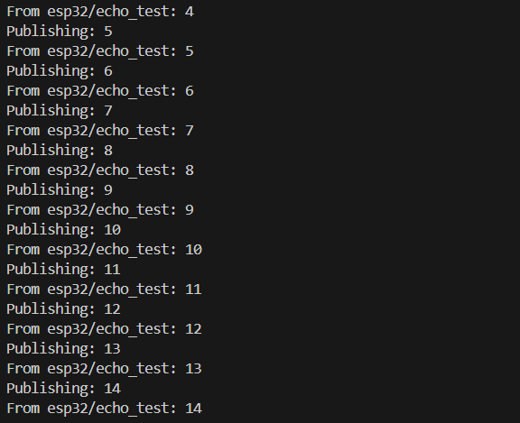
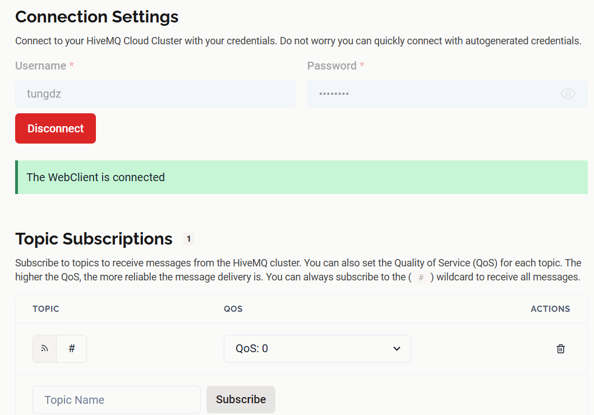
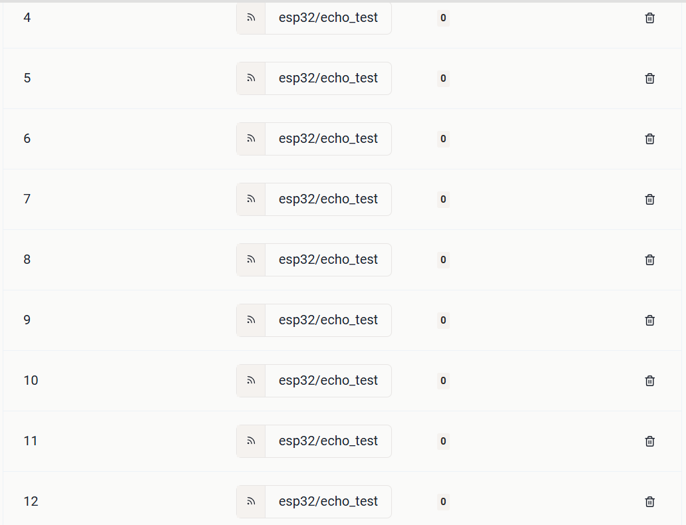
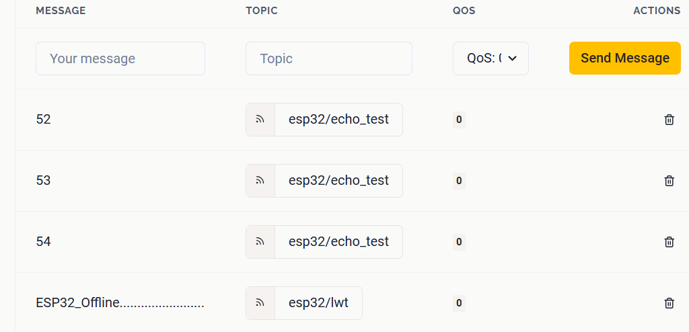
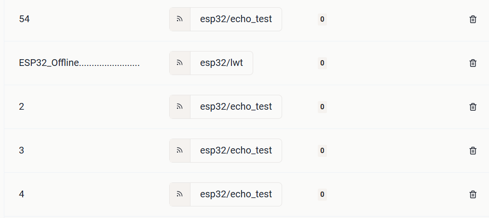

## Bố trí thí nghiệm 

- Dùng thư viện PubSubClient trên ESP32 kết nối với một MQTT Broker (thí nghiệm này sử dụng HiveMQ).
- Dựa trên mã mẫu của thí nghiệm 2, thí nghiệm này mô tả khái niệm Last Will Testament (LWT) và ứng dụng nó.

## Kịch bản thí nghiệm

- Sau khi ESP32 khởi động, sẽ kết nối WiFi vào một điểm phát AP đã định (ssid, và pass trong secrets/wifi.h) --> thành công
- Sẽ thấy MQTT Client kết nối đến broker thành công và bắt đầu gửi (publish) và nhận (subscribe) số đếm tăng dần trong `echo_topic` đều đặn
- Tiến hành tạo ra các kịch bản như: reset ESP32, ngắt kết nối wifi hay ngắt nguồn của ESP32.
- Quan sát Messages trên HiveMQ để thấy thông điệp LWT.
- Tiến hành kết nối lại nguồn hay wifi để quan sát hệ thống.

## Mục đích 
- Phát hiện sự cố của thiết bị, LWT thông báo rằng thiết bị đã bị ngắt kết nối bất thường (như mất nguồn hoặc lỗi WiFi).
- Giám sát được thiết bị từ xa.
- Nâng cao độ tin cậy của hệ thống IoT.

## Kết quả
- Khi khởi động ESP32 và kết nối wifi thành công, trên Serial Monitor sẽ quan sát được

**Hình 1**

- Trên giao diện HiveMQ, tab Web Client, tiến hành Connect ở mục Connection Settings.
- Mục Topic Subscriptions, subcribe topic # để in hết các tin nhắn.

**Hình 2**

- Tiến hành quan sát messages được hiển thị.

**Hình 3**

- Tiếp theo, ngắt kết nối ESP bằng cả ba phương thức sau: Ngắt kết nối wifi, ngắt nguồn điện wifi, reset ESP32, kết quả đều nhận được thông điệp LWT:

**Hình 4**
- Khi ESP được kết nối lại, messages được gửi bình thường.

**Hình 5**

## Kết luận 

- LWT giúp người dùng quản lý tốt hơn thiết bị IoT trong trường hợp thiết bị mất kết nối, đồng thời đưa ra hướng giải quyết kịp thời.
- LWT làm tăng độ tin cậy của hệ thống.

