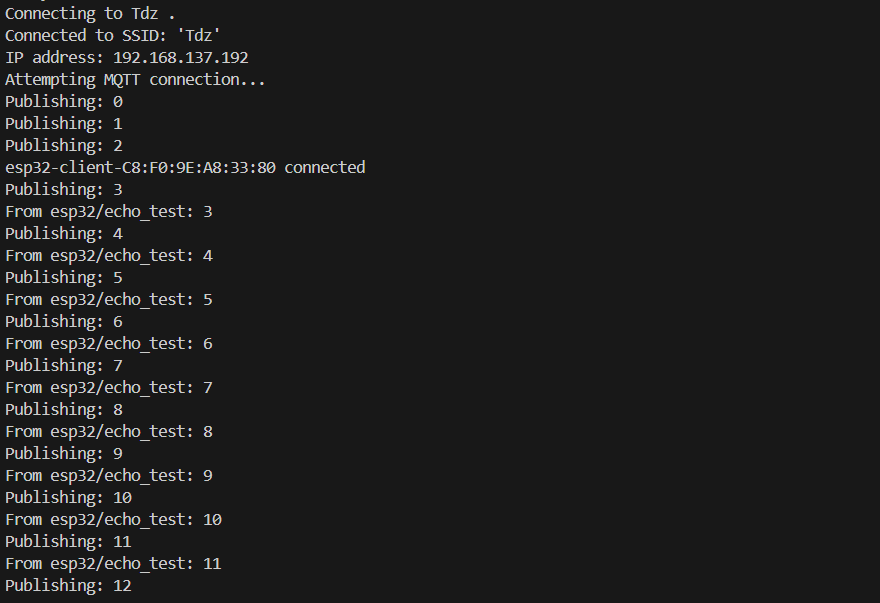
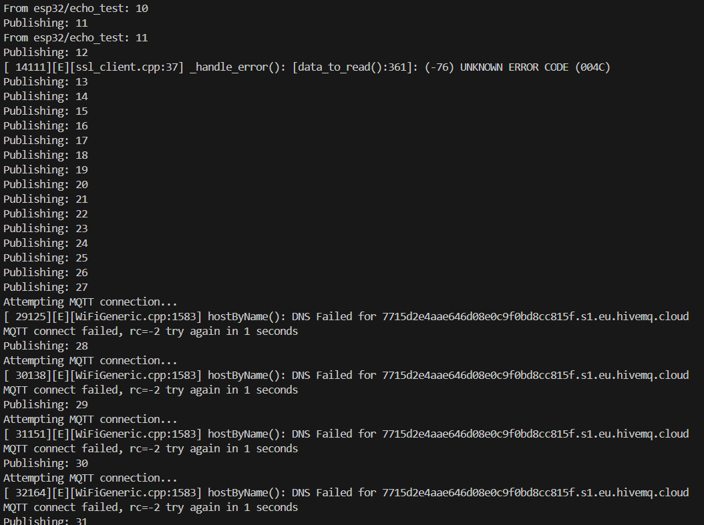
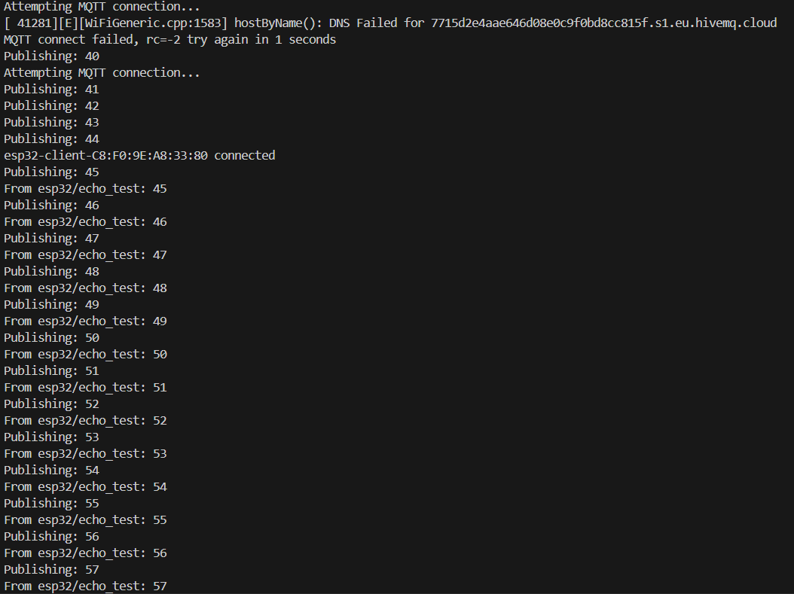

## Bố trí thí nghiệm 

- Dùng thư viện PubSubClient trên ESP32 kết nối với một MQTT Broker (thí nghiệm này sử dụng HiveMQ).
- Sử dụng mã đã được cung cấp trong bài học, tiến hành fork và clone về máy tính cá nhân.
- Tiến hành tạo tài khoản trên HiveMQ, thiết lập một broker miễn phí, thiết lập username và passwork, sử dụng kết nối mã hóa TLS từ client, dùng chứng chỉ ca_cert được cấp bởi HiveMQ.
- Tìm kiếm chứng chỉ ở `https://community.hivemq.com/t/frequently-asked-questions-hivemq-cloud/514#technical-faqs-1` và tải tại đường link `https://letsencrypt.org/certs/isrgrootx1.pem `
- Sau khi clone code về máy tính cá nhân, tiến hành tải chứng chỉ, tại thư mục src copy chứng chỉ vào file ca_cert.h 
- Mã trên Github không tải thư mục secrets gốc chứa file mqtt.h và wifi.h khi push lên để đảm bảo tính bảo mật.
- Trong thư mục src tạo thư mục secrets.
- Tạo hai file mqtt.h và wifi.h trong thư mục secrets.
- File wifi.h sẽ chứa thông tin wifi mà ESP sẽ kết nối:

```cpp
#pragma once

namespace WiFiSecrets
{
    const char *ssid = "your_wifi";     
    const char *pass = "wifi_password";  
}
```
- File mqtt.h sẽ chứa thông tin MQTT Broker kết nối trên HiveMQ, bao gồm:

```cpp
#pragma once

namespace MQTT
{
    const char *broker = "Cluster URL";  
    const int port = 8883;  
    const char *username = "your_username";  
    const char *password = "your_password";  
}

```

- Tiến hành điền đầy đủ thông tin, kiểm tra và nạp code cho ESP32.

## Kết quả
Sau khi nạp code thành công, tại Serial Monitor có thể thấy:


**Hình 1**

- Tiến hành lặp lại thí nghiệm, ngắt kết nối wifi.
- Khi wifi bị ngắt kết nối:


**Hình 2**

- ssl_client ở lớp dưới trên ESP32 báo lỗi (ssl_client.cpp:37 ...)
- Thư viện PubSubClient vẫn tiếp tục publishing.
- Sau 15s MQTT Client mới phát hiện ra việc mất kết nối MQTT và tiến hành `mqttReconnect`,  báo lỗi `failed, rc=-2`
- Khi khôi phục trở lại wifi, mất khoảng 3s để khôi phục kết nối MQTT.


**Hình 3**

