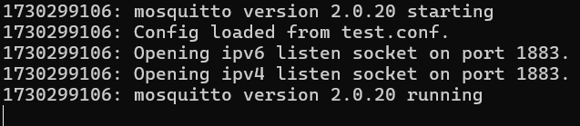
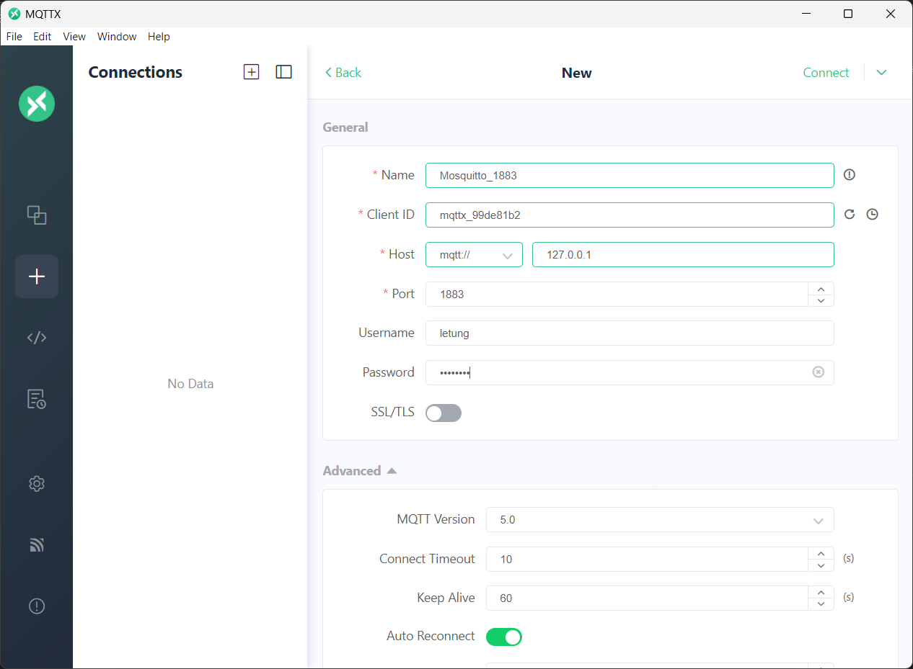
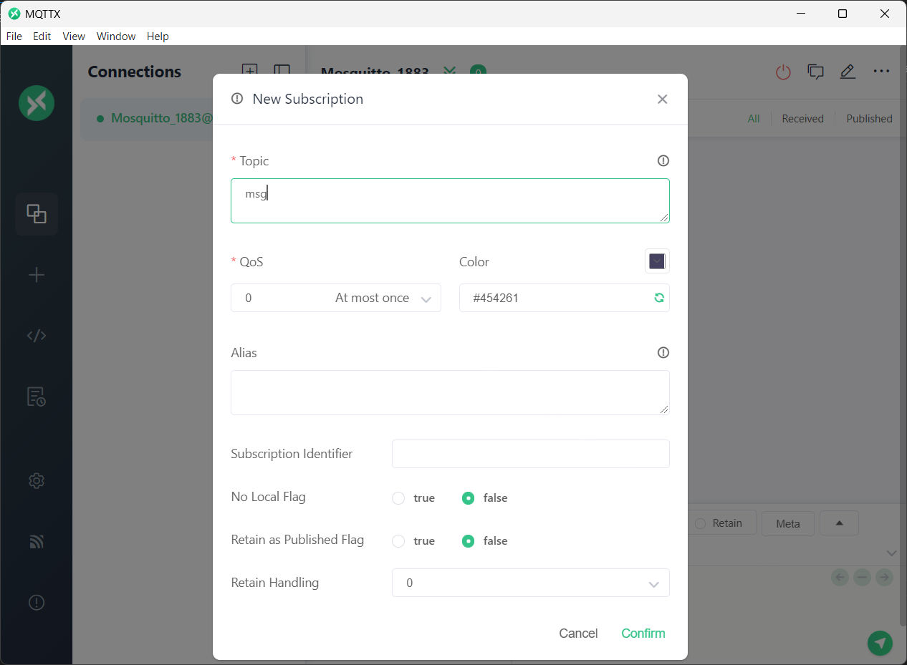
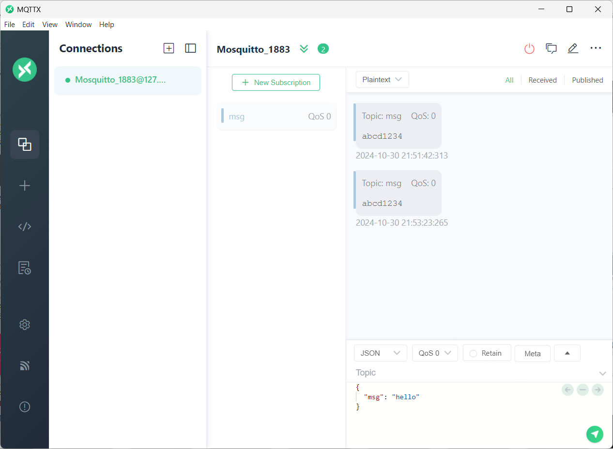
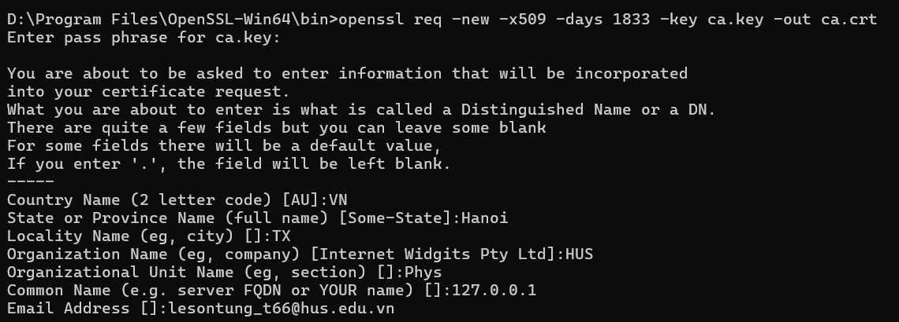
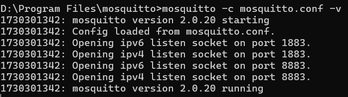
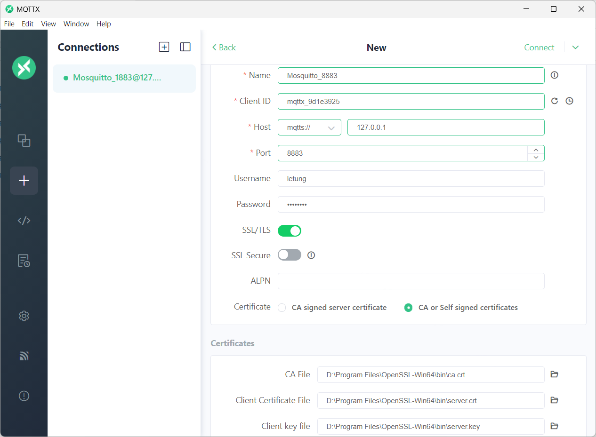
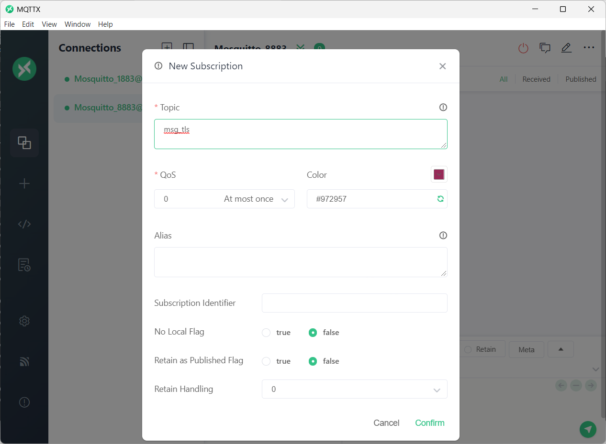
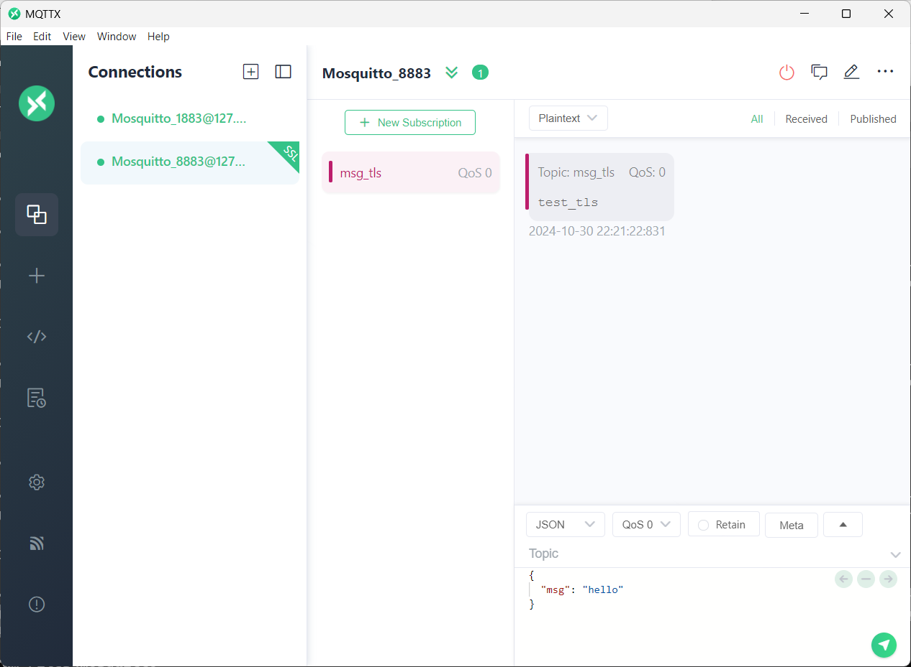

## Bố trí thí nghiệm 

- Cài đặt Mosquitto trên máy tính cá nhân, thiết lập kết nối đến Broker này thông qua port 1883 và 8883(TLS).
- Sử dụng MQTTX để kiểm tra và nhận thông điệp.

## Các bước tiến hành thí nghiệm

- Cài đặt Mosquitto trên máy.
- Cài đặt MQTTX.
- Cài đặt openssl để tạo chứng chỉ cho kết nối bảo mật TLS.
- LƯU Ý: Lệnh CMD phải được dẫn đến thư mục mosquitto hoặc openssl.

## Thiết lập bảo mật

- Trong thư mục Mosquitto, tạo file password.txt, tạo username và password theo dạng `username:password`
- Mở CMD, nhập lệnh `mosquitto_passwd -U password.txt` để mã hóa password, đảm bảo tính bảo mật.

## Với kết nối Port 1883.

- Trong thư mục cài đặt Mosquitto, chỉnh sửa file mosquitto.conf thành:
```
allow_anonymous false
password_file D:\Program Files\mosquitto\password.txt

listener 1883
```
- Mở CMD, nhập lệnh `mosquitto -c mosquitto.conf -v`
- Nếu báo lỗi, xem mục "Kiểm tra các cổng 1883 và 8883" ở cuối bài viết để sửa lỗi.
- Nếu không có lỗi gì sẽ nhận được kết quả:


**Hình 1**

- Tiếp theo, mở MQTTX, tạo "New Connection", thiết lập kết nối như hình và ấn `Connect`.

**Hình 2**

- Sau khi hiển thị biểu tượng `Connected`, tạo `New Subcription`, đặt tên cho topic.


**Hình 3**

- Mở một cửa sổ CMD khác có đường dẫn đến thư mục Mosquitto, nhập lệnh:
```
mosquitto_pub -h 127.0.0.1 -p 1883 -t 'topic' -m 'message' -q 0 -u 'username' -P 'password'
```
- Với `topic` là tên topic, `message` là nội dung thông điệp, username và password đã được thiết lập từ trước.
- Kết quả thu được ở MQTTX.

**Hình 4**
- Có thể thấy thông điệp đã được gửi đi từ Mosquitto(pub) và nhậ được ở MQTTX(sub).

## Với kết nối Port 8883.

- Do đây là kết nối có bảo mật, do đó cần phải tạo chứng chỉ bằng openssl.
- Tại CMD đường dẫn đến thư mục bin `path_to\OpenSSL-Win64\bin` nhập lệnh:
```
openssl genrsa -des3 -out ca.key 2048
```
- Lệnh này tạo ra ca.key có các khóa CA cho máy khách.
- Tạo mật khẩu sau đó nhập lệnh bên dưới để tạo chứng chỉ CA bằng khóa CA:
```
openssl req -new -x509 -days 1833 -key ca.key -out ca.crt
```
- Điền thông tin tương ứng:

**Hình 5**
- Tạo khóa riêng cho máy chủ:
```
openssl genrsa -out server.key 2048
```
- Tạo yêu cầu chứng chỉ cho máy chủ:
```
openssl req -new -out server.csr -key server.key
```
- Tiến hành điền thông tin tương tự.
- Tạo chứng chỉ cho máy chủ từ yêu cầu CSR:
```
openssl x509 -req -in server.csr -CA ca.crt -CAkey ca.key -CAcreateserial -out server.crt -days 360
```
- Sau khi tạo xong chứng chỉ, tiến hành cấu hình file mosquitto.conf
- Trong thư mục cài đặt Mosquitto, ta được ba file `ca.crt`, `server.crt`, `server.key`
- Chỉnh sửa file mosquitto.conf thành:
```
allow_anonymous false
password_file D:\Program Files\mosquitto\password.txt

listener 1883
listener 8883

protocol mqtt
cafile D:\Program Files\mosquitto\certs\ca.crt
certfile D:\Program Files\mosquitto\certs\server.crt
keyfile D:\Program Files\mosquitto\certs\server.key
require_certificate true
tls_version tlsv1.2
```
- Mở CMD, nhập lệnh `mosquitto -c mosquitto.conf -v`
- Nếu báo lỗi, xem mục "PHỤ LỤC: Kiểm tra các cổng 1883 và 8883" ở cuối bài viết để sửa lỗi.
- Nếu không có lỗi gì sẽ nhận được kết quả:


**Hình 6**
- Mở MQTTX, thiết lập thêm phần `SSL/TLS`, thêm đường dẫn của chứng chỉ:


**Hình 7**
- Tạo `New Subcription`, đặt tên cho topic.

**Hình 8**

- Mở một cửa sổ CMD khác có đường dẫn đến thư mục Mosquitto, nhập lệnh:
```
mosquitto_pub -h 127.0.0.1 -p 8883 --cafile "path_to\ca.crt" --cert "path_to\server.crt" --key "path_to\server.key" -t 'topic' -m 'massage' -q 0 -u 'username' -P 'password'
```
- Với `topic` là tên topic, `message` là nội dung thông điệp, username và password đã được thiết lập từ trước.
- Tại MQTTX, thu được kết quả:


**Hình 9**

## Kết quả
- Thiết lập được kết nối đến cổng 1883 trên Mosquitto.
- Biết cách tạo chứng chỉ bằng openssl.
- Thiết lập được kết nối bảo mật qua cổng 8883(TLS).

## PHỤ LỤC: Kiểm tra các cổng 1883 và 8883
- Mở CMD với quyền Admin, nhập lệnh `netstat -ano | findstr 1883` và `netstat -ano | findstr 8883`
- Kết quả có thể là
```
  TCP    0.0.0.0:1883           0.0.0.0:0              LISTENING       5604
  TCP    [::]:1883              [::]:0                 LISTENING       5604

```
- Sử dụng lệnh `taskkill /F /PID 5604` để kết thúc tiến trình.
- Tương tự với 8883. 


**Hình 1**

- Trên giao diện HiveMQ, tab Web Client, tiến hành Connect ở mục Connection Settings.
- Mục Topic Subscriptions, subcribe topic # để in hết các tin nhắn.


**Hình 2**

- Tiến hành quan sát messages được hiển thị.


**Hình 3**

- Tiếp theo, ngắt kết nối ESP bằng cả ba phương thức sau: Ngắt kết nối wifi, ngắt nguồn điện wifi, reset ESP32, kết quả đều nhận được thông điệp LWT:


**Hình 4**
- Khi ESP được kết nối lại, messages được gửi bình thường.


**Hình 5**


## Kết luận 

- LWT giúp người dùng quản lý tốt hơn thiết bị IoT trong trường hợp thiết bị mất kết nối, đồng thời đưa ra hướng giải quyết kịp thời.
- LWT làm tăng độ tin cậy của hệ thống.

